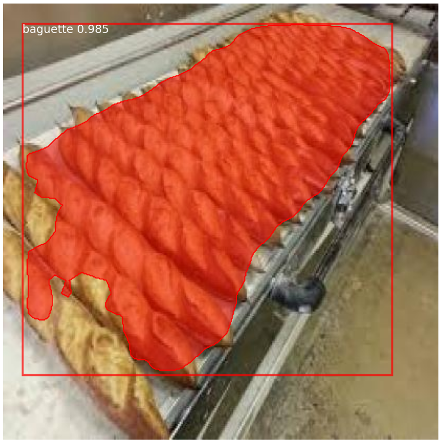
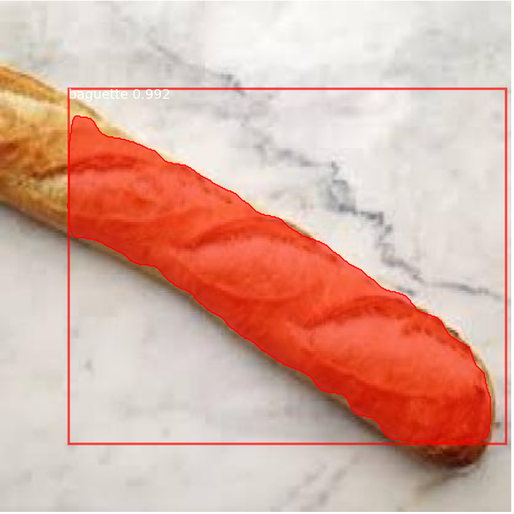
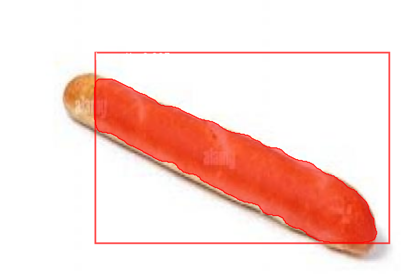
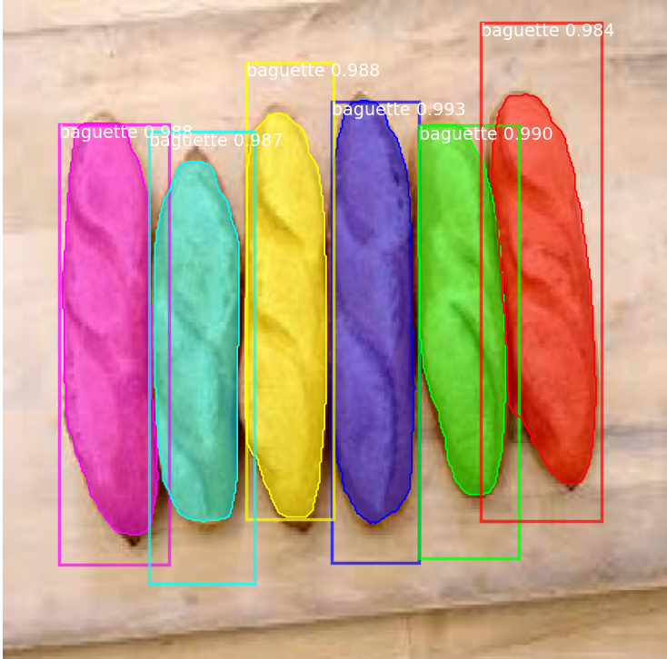
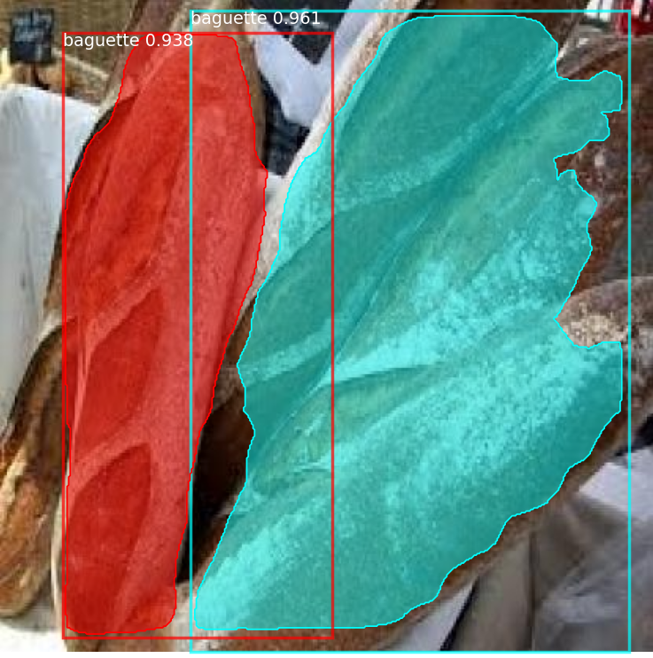

# Object-Detection

Suite à de nombreux problèmes, je n'ai réussi à faire marcher Mask_RCNN qu'à 19h10 le 11/11/2024 et à lancer mon premier entrainement vers 21h. Le programme est actuellement toujours en train de tourner. Je ne pourrai donc pas vous fournir beaucoup de données en testant avec d'autres paramètres comme le nombre d'epochs, l'activation utilisée, le learning rate ou encore l'optimizer. Je ne sais pas si j'aurai même le temps de faire la matrice de confusion. Je peux néanmoins vous fournir le dataset construit et utilisé à temps.

